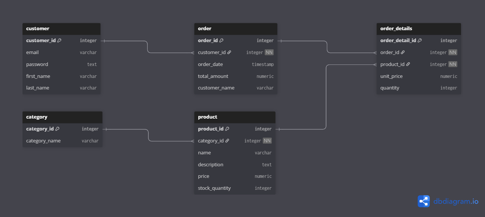

# E-Commerce Database Documentation

This document describes the database schema, entity relationships, and example analytical SQL queries used in the e-commerce system. The goal is to provide a clear, professional overview for development and showcase purposes.

---

## 1. Database Schema

### customers
```sql
CREATE TABLE customers (
    id SERIAL PRIMARY KEY,
    email VARCHAR(100) NOT NULL UNIQUE,
    password TEXT NOT NULL,
    first_name VARCHAR(100) NOT NULL,
    last_name VARCHAR(100) NOT NULL
);
```

### categories
```sql
CREATE TABLE categories (
    id SERIAL PRIMARY KEY,
    category_name VARCHAR(100) NOT NULL UNIQUE
);
```

### products
```sql
CREATE TABLE products (
    id SERIAL PRIMARY KEY,
    category_id INTEGER NOT NULL REFERENCES categories(id) ON DELETE CASCADE,
    name VARCHAR(100) NOT NULL,
    description TEXT,
    price NUMERIC(10, 2) NOT NULL,
    stock_quantity INTEGER NOT NULL DEFAULT 0 CHECK (stock_quantity >= 0)
);
```

### orders
```sql
CREATE TABLE orders (
    id SERIAL PRIMARY KEY,
    customer_id INTEGER NOT NULL REFERENCES customers(id) ON DELETE CASCADE,
    order_date TIMESTAMP NOT NULL DEFAULT NOW(),
    total_amount NUMERIC(10, 2) NOT NULL,
    customer_name VARCHAR(200)      -- denormalized snapshot field
);
```

### order_details
```sql
CREATE TABLE order_details (
    id SERIAL PRIMARY KEY,
    order_id INTEGER NOT NULL REFERENCES orders(id) ON DELETE CASCADE,
    product_id INTEGER NOT NULL REFERENCES products(id) ON DELETE CASCADE,
    unit_price NUMERIC(10, 2) NOT NULL,
    quantity INTEGER NOT NULL DEFAULT 1 CHECK (quantity >= 1)
);
```

---

## 2. Entity Relationships

| Parent     | Child         | Relationship | Foreign Key              |
| ---------- | ------------- | ------------ | ------------------------ |
| customers  | orders        | 1 : M        | orders.customer_id       |
| categories | products      | 1 : M        | products.category_id     |
| orders     | order_details | 1 : M        | order_details.order_id   |
| products   | order_details | 1 : M        | order_details.product_id |

---

## 3. ERD Diagram


---

## 4. Analytical SQL Queries
This section includes useful SQL queries for getting insights from the e-commerce data. These examples show how to check daily revenue, find top-selling products, and see which customers spent the most in a given period.

### 4.1 Daily Revenue Report
```sql
SELECT 
    DATE(order_date) AS report_date,
    SUM(total_amount) AS total_revenue
FROM orders
WHERE DATE(order_date) = DATE '2025-01-18'
GROUP BY DATE(order_date);
```

### 4.2 Top-Selling Products in a Month
```sql
SELECT
    p.id AS product_id,
    p.name AS product_name,
    SUM(od.unit_price * od.quantity) AS total_revenue
FROM order_details od
JOIN orders o ON od.order_id = o.id
JOIN products p ON od.product_id = p.id
WHERE DATE_TRUNC('month', o.order_date) = DATE_TRUNC('month', DATE '2025-01-01')
GROUP BY p.id, p.name
ORDER BY total_revenue DESC
LIMIT 3;
```

### 4.3 Customers Who Spent More Than 500 in a Month
```sql
SELECT
    c.id AS customer_id,
    CONCAT(c.first_name, ' ', c.last_name) AS customer_name,
    SUM(o.total_amount) AS total_spent
FROM customers c
JOIN orders o ON o.customer_id = c.id
WHERE DATE_TRUNC('month', o.order_date) = DATE '2025-01-01'
GROUP BY c.id, customer_name
HAVING SUM(o.total_amount) > 500
ORDER BY total_spent DESC;
```

---

## 5. Denormalization Notes
The `orders` table includes a denormalized `customer_name` column.  
This stores the customer's full name at the time of order creation.  
```sql
ALTER TABLE orders
ADD COLUMN customer_name VARCHAR(200);
```

Benefits:
- Faster reporting queries that list orders with customer names
- No need to join with `customers`
- Historical accuracy preserved even if the customer later updates their name
---
